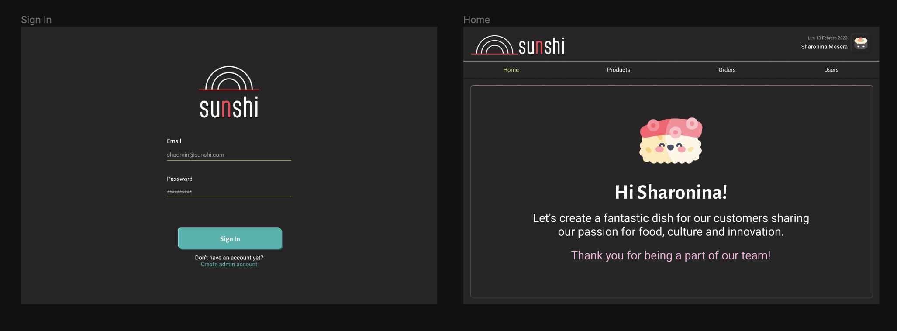
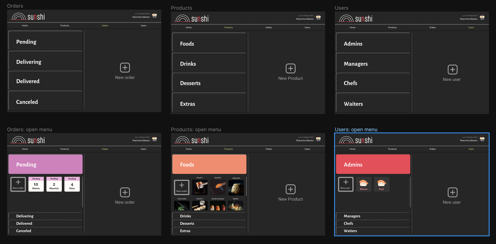
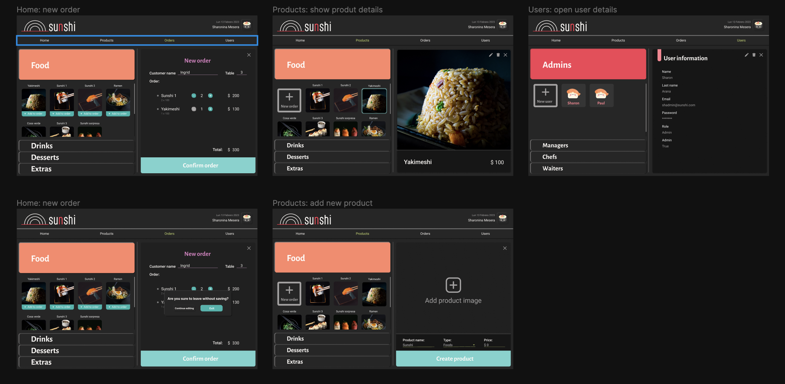
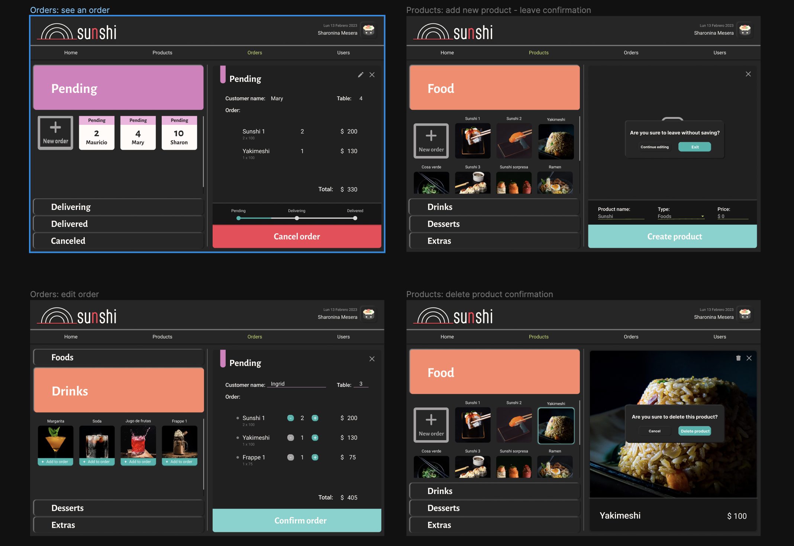
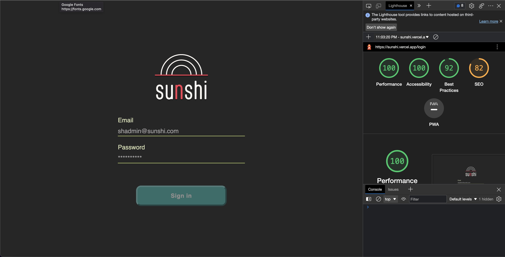

#

App created for a japanese food restaurant

# Tech Stack

**Client:** React, JavaScript, Stylus, Vitest

**Server:** Node, Express, MongoDB

# Prototypes

## High fidelity






# Usability Test: Lighthouse



# Color Reference

| Color  | Hex                                                              |
| ------ | ---------------------------------------------------------------- |
| Jade   |  #34B5AD |
| Orange |  #EF5A30 |
| Green  |  #C9DF6D |
| Pink   |  #D97CBF |
| Red    |  #F34055 |

# Running Tests

To run tests, run the following command

```bash
  npm run test
```
